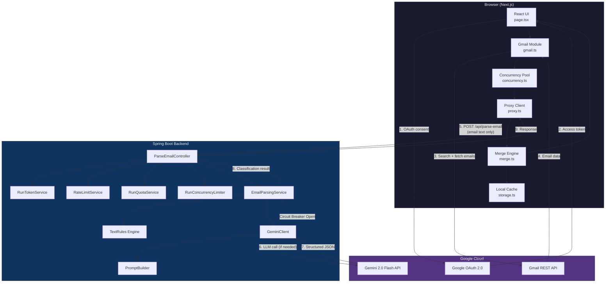
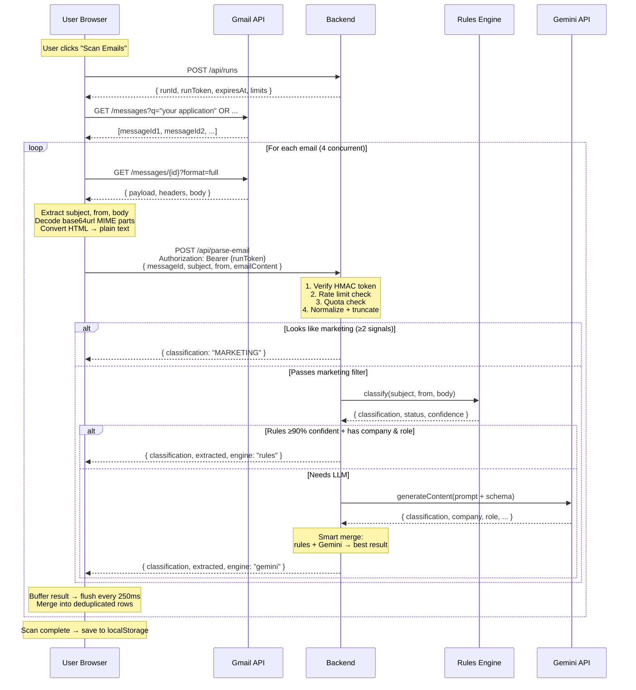
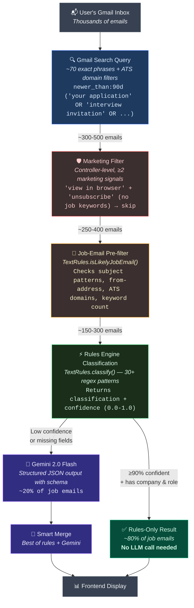
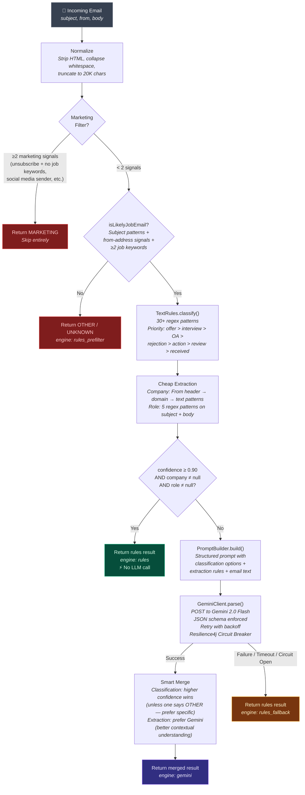
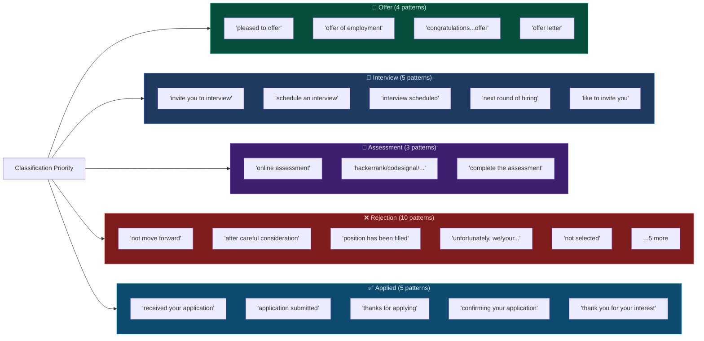
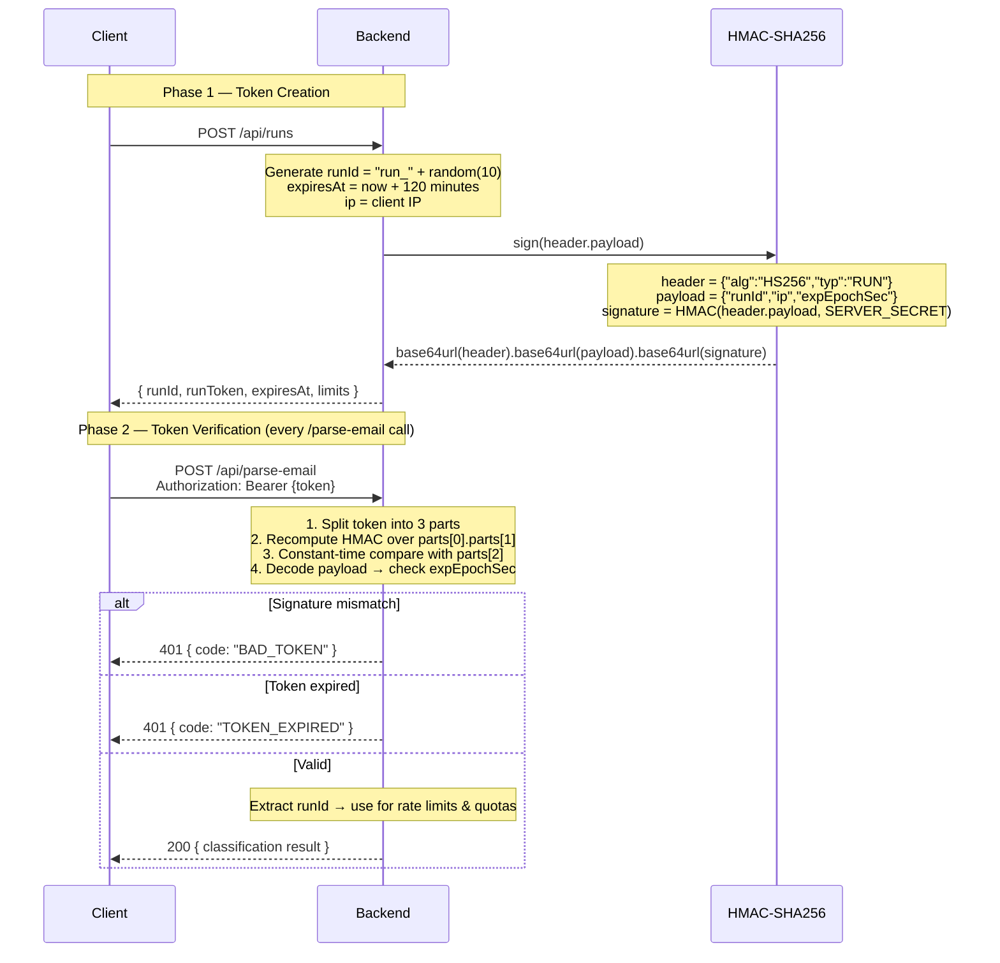
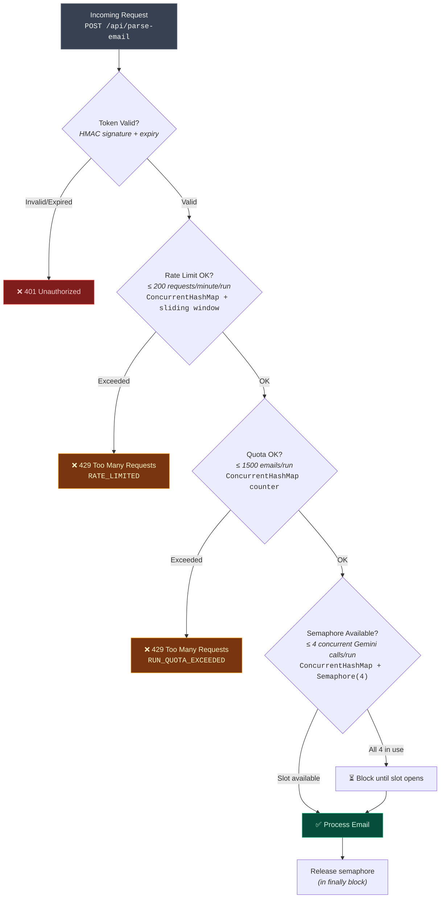
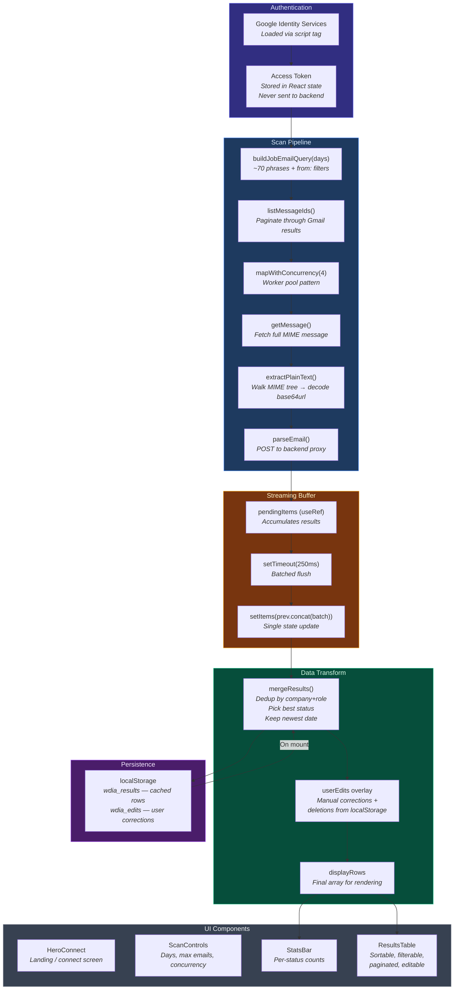
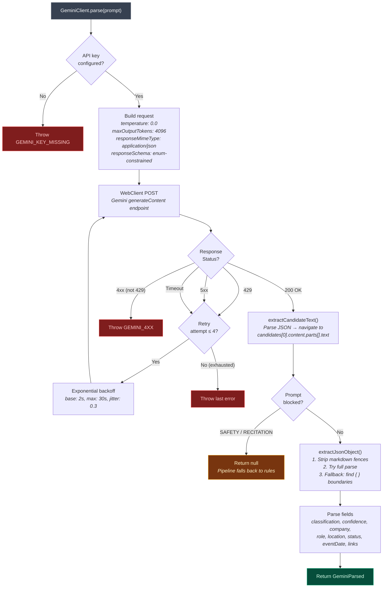
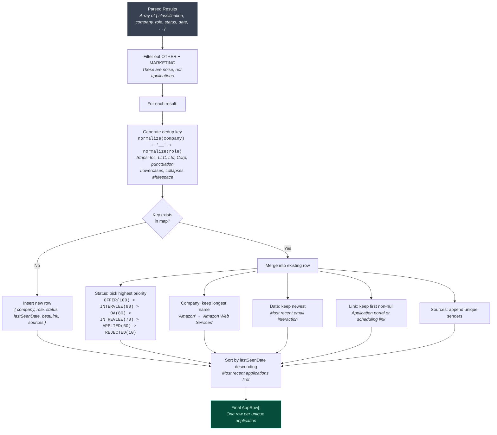

# WhereDidIApply — Design Documentation

> **Version:** 1.0  
> **Author:** Adebowale Adebayo  
> **Last Updated:** March 2026

---

## Table of Contents

1. [System Overview](#1-system-overview)
2. [High-Level Architecture](#2-high-level-architecture)
3. [Request Lifecycle — One Email's Journey](#3-request-lifecycle--one-emails-journey)
4. [Email Filtering Funnel](#4-email-filtering-funnel)
5. [Classification Pipeline (Backend)](#5-classification-pipeline-backend)
6. [Security Model — Run Tokens](#6-security-model--run-tokens)
7. [Abuse Prevention Layers](#7-abuse-prevention-layers)
8. [Frontend Architecture & Data Flow](#8-frontend-architecture--data-flow)
9. [Gemini Integration & Resilience](#9-gemini-integration--resilience)
10. [Merge & Deduplication Logic](#10-merge--deduplication-logic)
11. [Observability & DevOps](#11-observability--devops)
12. [Project Structure](#12-project-structure)
13. [Technology Decisions & Trade-offs](#13-technology-decisions--trade-offs)

---

## 1. System Overview

WhereDidIApply scans a user's Gmail inbox, identifies job-application-related emails, classifies them (applied, interview, rejected, offer, etc.), and presents a searchable dashboard of every application.

**Core design principles:**

| Principle | Implementation |
|-----------|---------------|
| **Privacy-first** | Gmail access tokens never leave the browser. The backend only receives email text for parsing — no tokens, no storage. |
| **Cost-efficient AI** | A deterministic rules engine handles ~80% of emails without touching the LLM. Gemini is a fallback, not the default. |
| **Stateless backend** | No database. Run tokens are self-validating (HMAC-signed). Rate limits and quotas are in-memory per session. |
| **Resilient** | Retries with exponential backoff at every network boundary. Graceful degradation — if Gemini fails, rules still produce results. |

---

## 2. High-Level Architecture



**Data flow summary:**
- The **browser** holds the Gmail token and fetches emails directly — the backend never sees the token.
- The **backend** receives only email text (subject, from, body) and returns a classification.
- **Gemini** is called by the backend only when the rules engine isn't confident enough.

---

## 3. Request Lifecycle — One Email's Journey



---

## 4. Email Filtering Funnel

Each stage eliminates emails before reaching the next, more expensive stage. This is the key cost optimization — only a fraction of emails ever reach the LLM.



**Approximate numbers for a typical scan (500 matched emails):**

| Stage | Emails | Cost |
|-------|--------|------|
| Gmail search query | ~500 | Free (Gmail API) |
| Marketing filter | ~50 skipped | Microseconds each |
| Pre-filter (not job-related) | ~100 skipped | Microseconds each |
| Rules engine (high confidence) | ~280 classified | Microseconds each |
| Gemini API calls | ~70 | ~1-3 seconds each |

**Result:** Only ~20% of emails touch the LLM, saving significant latency and API cost.

---

## 5. Classification Pipeline (Backend)



### Rules Engine Detail — Pattern Categories



---

## 6. Security Model — Run Tokens



**Token structure (similar to JWT, purpose-built):**

```
eyJhbGciOiJIUzI1NiIsInR5cCI6IlJVTiJ9.eyJydW5JZCI6InJ1bl9hYmMxMjMiLC...
├── header (base64url) ──────┤├── payload (base64url) ──────────────────────...
                                                          ├── signature (base64url)
```

| Field | Purpose |
|-------|---------|
| `runId` | Unique session identifier — scopes all rate limits and quotas |
| `ip` | Client IP at creation time — available for future IP pinning |
| `expEpochSec` | Expiry timestamp — tokens live 120 minutes |

**Why not a library (e.g., `java-jwt`)?** The payload is 3 fields. A custom implementation avoids a dependency for something trivial. The cryptographic primitive (`HmacSHA256`) comes from the JDK's `javax.crypto` package. Signature comparison uses a constant-time algorithm to prevent timing attacks.

---

## 7. Abuse Prevention Layers



| Layer | Mechanism | Scope | Data Structure | Purpose |
|-------|-----------|-------|----------------|---------|
| **Token Verification** | HMAC-SHA256 signature | Per request | Stateless (cryptographic) | Prevents unauthorized access |
| **Rate Limiter** | Sliding window counter | Per run, per minute | `ConcurrentHashMap<runId, Window>` | Prevents request flooding |
| **Quota** | Absolute counter | Per run, lifetime | `ConcurrentHashMap<runId, Integer>` | Caps total emails per session |
| **Concurrency Limiter** | Java `Semaphore(4)` | Per run, concurrent | `ConcurrentHashMap<runId, Semaphore>` | Prevents Gemini API overload |

**Why all in-memory?** Every limit is scoped to a `runId`, which lives at most 120 minutes. There's no need to persist rate limit state across server restarts. If the server restarts, all run tokens are effectively invalidated anyway (clients must create a new run).

---

## 8. Frontend Architecture & Data Flow



### Performance Optimizations

| Optimization | Problem It Solves |
|-------------|-------------------|
| **Batched streaming** (250ms timer) | Without batching, 500 emails × 4 concurrent = hundreds of `setState` calls per second, each triggering a full re-render |
| **`React.memo`** on all components | Parent state changes (progress, items) don't re-render children whose props haven't changed |
| **Stable `useCallback` handlers** | `onEdit` and `onDelete` are stable references — `ResultsTable` doesn't re-render when parent state changes |
| **CSS `content-visibility: auto`** on table rows | Browser skips layout/paint for off-screen rows — massive win for large tables |
| **`will-change: transform`** on sticky header | Promotes header to its own GPU compositor layer — scroll doesn't trigger header repaint |
| **No `backdrop-blur`** on scrolling elements | `backdrop-blur` forces re-composite on every scroll frame — removed from all scroll-visible elements |

---

## 9. Gemini Integration & Resilience



### Structured Output Schema

The Gemini request includes a `responseSchema` that enforces:

```json
{
  "type": "OBJECT",
  "properties": {
    "classification": { "type": "STRING", "enum": ["APPLICATION_CONFIRMATION", "OA_ASSESSMENT", "INTERVIEW", "OFFER", "REJECTION", "ACTION_REQUIRED", "OTHER"] },
    "confidence":     { "type": "NUMBER" },
    "company":        { "type": "STRING" },
    "role":           { "type": "STRING" },
    "location":       { "type": "STRING" },
    "status":         { "type": "STRING", "enum": ["APPLIED", "IN_REVIEW", "OA", "INTERVIEW", "OFFER", "REJECTED", "ACTION_REQUIRED", "UNKNOWN"] },
    "eventDate":      { "type": "STRING" },
    "links":          { "type": "ARRAY", "items": { "type": "OBJECT", "properties": { "type": { "type": "STRING" }, "url": { "type": "STRING" } } } }
  },
  "required": ["classification", "confidence", "status", "links"]
}
```

This eliminates freeform text parsing. Gemini is forced to return valid JSON matching the schema, with enum values constrained to the exact set we support.

---

## 10. Merge & Deduplication Logic

A single job application often generates multiple emails (confirmation → review → interview → rejection). The merge engine collapses these into one row.



**Example:** Three emails from Amazon about the same role:

| Email | Classification | Status |
|-------|---------------|--------|
| "Thank you for applying to SWE Intern" | APPLICATION_CONFIRMATION | APPLIED |
| "Your application is being reviewed" | APPLICATION_UNDER_REVIEW | IN_REVIEW |
| "We will not be moving forward" | REJECTION | REJECTED |

**Dedup key:** `"amazon__software engineer intern"`

**Merged row:** Company: Amazon, Role: Software Engineer Intern, Status: **REJECTED** (highest priority event, though negative), Last Seen: date of the rejection email.

---

## 11. Observability & DevOps

WhereDidIApply is built for production readiness, utilizing standard cloud-native operational patterns.

### Structured Logging (JSON)
All backend logs are emitted in **Logstash JSON format** via `logback-spring.xml`. 
This allows cloud logging platforms (GCP Cloud Logging, Datadog) to instantly index fields (e.g., `logger`, `level`, `timestamp`) rather than relying on brittle regex parsing of plain text logs.

### Circuit Breaker (Resilience4j)
To protect the backend from hanging threads when the Gemini API degrades, a **Circuit Breaker** is applied to `GeminiClient`:
1. If the LLM fails or times out repeatedly (e.g., 50% failure rate over a sliding window), the circuit **Opens**.
2. Subsequent requests immediately fail fast, returning a `503 Service Unavailable` without attempting the network call.
3. The `EmailParsingService` catches this and gracefully degrades to returning the **Rules-Only** classification, ensuring the user still gets results (even if slightly less accurate) rather than a crashed request.

### API Documentation (OpenAPI/Swagger)
The backend exposes interactive API documentation via Springdoc OpenAPI. In development, it is available at `/api/swagger-ui.html`.

### CI/CD Pipeline
Deployment is fully automated via **GitHub Actions**:
1. **CI**: On Pull Request, the code is compiled and tested (`mvn test`).
2. **CD**: On push to `main`, a Docker image is built and pushed to Google Artifact Registry.
3. **Deployment**: The image is deployed to **Google Cloud Run** (serverless).
4. **Security**: The pipeline uses **Workload Identity Federation** to authenticate with GCP, eliminating the need to store long-lived Service Account JSON keys in GitHub Secrets.

---

## 12. Project Structure

```
WhereDidIApply/
├── README.md                          # Project overview + setup guide
├── DESIGN.md                          # This document
├── LICENSE                            # MIT
├── docker-compose.yml                 # One-command local deployment
├── .env.example                       # Template for Docker Compose env vars
│
├── apps/
│   ├── proxy/                         # Spring Boot backend
│   │   ├── pom.xml                    # Maven dependencies
│   │   ├── Dockerfile                 # Multi-stage Docker build
│   │   ├── src/main/
│   │   │   ├── resources/
│   │   │   │   └── application.yaml   # Config (ports, limits, API URLs)
│   │   │   └── java/tech/wheredidiapply/proxy/
│   │   │       ├── ProxyApplication.java  # Spring Boot entry point
│   │   │       ├── config/
│   │   │       │   └── CorsConfig.java    # CORS for localhost + production domain
│   │   │       ├── controller/
│   │   │       │   ├── RunController.java        # POST /api/runs — create run token
│   │   │       │   └── ParseEmailController.java # POST /api/parse-email — main pipeline
│   │   │       ├── model/
│   │   │       │   ├── ParseEmailRequest.java    # Inbound DTO (validated)
│   │   │       │   ├── ParseEmailResponse.java   # Outbound DTO (with factory helpers)
│   │   │       │   └── CreateRunResponse.java    # Run creation response
│   │   │       ├── security/
│   │   │       │   ├── TokenCodec.java           # HMAC sign/verify (low-level crypto)
│   │   │       │   └── RunTokenService.java      # Token lifecycle (create, verify)
│   │   │       ├── limits/
│   │   │       │   ├── RateLimitService.java     # Sliding-window rate limiter
│   │   │       │   ├── RunQuotaService.java      # Per-run email quota
│   │   │       │   └── RunConcurrencyLimiter.java # Semaphore-based concurrency cap
│   │   │       ├── service/
│   │   │       │   ├── EmailParsingService.java  # Core pipeline (rules → Gemini → merge)
│   │   │       │   ├── TextRules.java            # 30+ regex patterns + pre-filter
│   │   │       │   ├── GeminiClient.java         # HTTP client for Gemini API
│   │   │       │   └── PromptBuilder.java        # LLM prompt construction
│   │   │       └── error/
│   │   │           ├── ApiException.java         # Custom exception (status + code)
│   │   │           ├── ApiError.java             # Error response DTO
│   │   │           └── GlobalExceptionHandler.java # @RestControllerAdvice
│   │   └── src/test/
│   │
│   └── frontend/                      # Next.js frontend
│       ├── package.json
│       ├── Dockerfile                 # Multi-stage Docker build (standalone)
│       ├── next.config.ts             # Next.js config (standalone output)
│       ├── src/
│       │   ├── app/
│       │   │   ├── layout.tsx         # Root layout (fonts, GSI script, providers)
│       │   │   ├── page.tsx           # Main page (auth, scan, render)
│       │   │   ├── Providers.tsx      # Google OAuth provider wrapper
│       │   │   ├── globals.css        # Tailwind + performance CSS
│       │   │   └── components/
│       │   │       ├── HeroConnect.tsx     # Landing screen (connect Gmail)
│       │   │       ├── ScanControls.tsx    # Scan parameters + progress bar
│       │   │       ├── StatsBar.tsx        # Status count summary
│       │   │       ├── ResultsTable.tsx    # Sortable, paginated, editable table
│       │   │       └── StatusBadge.tsx     # Color-coded status pills
│       │   └── lib/
│       │       ├── gmail.ts           # Gmail API client (search, fetch, parse MIME)
│       │       ├── proxy.ts           # Backend API client (createRun, parseEmail)
│       │       ├── concurrency.ts     # Worker pool (mapWithConcurrency)
│       │       ├── merge.ts           # Dedup + merge logic
│       │       ├── storage.ts         # localStorage persistence
│       │       └── csv.ts             # CSV export (via papaparse)
│       └── public/
```

---

## 13. Technology Decisions & Trade-offs

| Decision | Alternatives Considered | Why This Choice |
|----------|------------------------|-----------------|
| **Client-side Gmail fetch** | Backend fetches via Gmail API with stored tokens | Privacy. The user's OAuth token never touches our server. We can't leak what we don't have. |
| **Hybrid rules + LLM** | LLM-only, rules-only | LLM-only: 3x slower, 5x more expensive. Rules-only: misses ambiguous/complex emails. Hybrid gives best of both. |
| **Custom HMAC tokens** (not JWT library) | `java-jwt`, Spring Security | Payload is 3 fields. A library adds a dependency for 50 lines of code. `javax.crypto.Mac` is JDK-standard. |
| **No database** | PostgreSQL, Redis | Nothing needs persistence. Run tokens are self-validating. Rate limits are ephemeral (120 min max). Adding a DB adds operational complexity for zero benefit. |
| **Spring WebFlux WebClient** (not RestTemplate) | `RestTemplate`, `HttpClient` | WebClient supports non-blocking I/O and reactive retry (`.retryWhen()`). RestTemplate is synchronous and deprecated for new projects. |
| **Gemini 2.0 Flash** (not GPT-4, Claude) | OpenAI GPT-4, Claude 3.5 | Free tier with generous limits. Structured JSON output mode eliminates parsing issues. Low latency (~1-2s). |
| **Resilience4j Circuit Breaker** | Manual try/catch timeouts | Standardized way to handle cascading failures in distributed systems. Prevents thread exhaustion when upstream APIs degrade. |
| **JSON Logging (Logback)** | Standard console text logs | JSON logs are machine-readable, making observability and querying in cloud environments (like GCP/Datadog) trivial. |
| **localStorage** (not server-side cache) | Redis, cookies, IndexedDB | Results are private (never leave the browser). localStorage is simple, synchronous, and sufficient for the data size. |
| **250ms flush batching** (not requestAnimationFrame) | `requestAnimationFrame`, no batching | 250ms is fast enough to feel real-time but slow enough to batch 4-10 results per flush. `rAF` would fire 60x/sec (overkill). |
| **CSS `content-visibility: auto`** on table rows | Virtual scrolling (react-virtual) | Zero-dependency solution. Browser natively skips layout/paint for off-screen rows. Virtual scrolling adds complexity and library weight. |

---

*This document reflects the architecture as of March 2026. For setup instructions, see the [README](README.md).*
