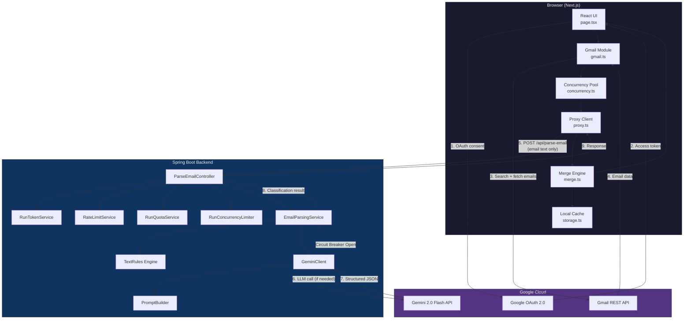
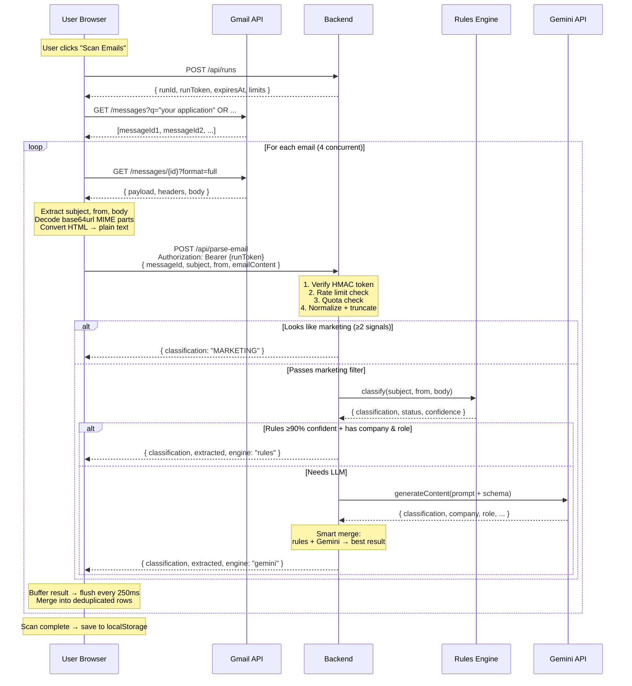

# WhereDidIApply — Design Overview

---

> **Note:** This document is written from the perspective of a solo developer. All design, implementation, and decisions are the result of individual work. Where the text previously referred to "our" or "we," it now uses "I" or "my" to reflect this.

## Table of Contents

1. [Introduction](#1-introduction)
2. [Guiding Principles](#2-guiding-principles)
3. [Architecture Overview](#3-architecture-overview)
4. [Data Flow](#4-data-flow)
5. [Privacy Model](#5-privacy-model)
6. [Security Model](#6-security-model)
7. [Contributing](#7-contributing)
8. [Contact](#8-contact)

---

# 1. Introduction

WhereDidIApply is a privacy-first, open-source job application tracker that turns your Gmail inbox into a job search dashboard. I designed and built this project to help job seekers organize and analyze their job search process, with a strong emphasis on user privacy and transparency.

---

# 2. Guiding Principles

- **Privacy-first:** Your Gmail credentials never touch any server except Google. Email text is sent to the backend only for classification, never stored or logged. You can self-host the entire stack for maximum privacy.
- **Solo-built:** All code, design, and documentation are authored and maintained by a single developer (me).
- **Transparency:** Every data flow and processing step is documented. See [PRIVACY.md](PRIVACY.md) for a plain-English explanation.
- **No vendor lock-in:** You can run everything locally, modify, or fork as you wish.

---

# 3. Architecture Overview

**Data flow summary:**
- The **browser** holds the Gmail token and fetches emails directly — the backend never sees the token.
- The **backend** receives only email text (subject, from, body) and returns a classification.
- **Gemini** is called by the backend only when the rules engine isn't confident enough.

---

# 4. Data Flow

---

# 5. Privacy Model

I take privacy seriously. The backend is stateless, and no email content is ever stored or logged. If you self-host, no data ever leaves your infrastructure (except for Gemini API calls, if enabled).

---

# 6. Security Model

As a solo developer, I have implemented HMAC-signed run tokens, in-memory rate limiting, and strict input validation. See [SECURITY.md](SECURITY.md) for details on how to report vulnerabilities.

---

# 7. Contributing

I welcome contributions! Please see [CONTRIBUTING.md](CONTRIBUTING.md) for guidelines. Note that all code reviews and merges are handled by me.

---

# 8. Contact

If you have questions, suggestions, or want to report a bug, please open an issue on GitHub. As the sole maintainer, I will respond as quickly as possible.

---

*This document reflects the architecture as of March 2026. For setup instructions, see the [README](README.md).*
